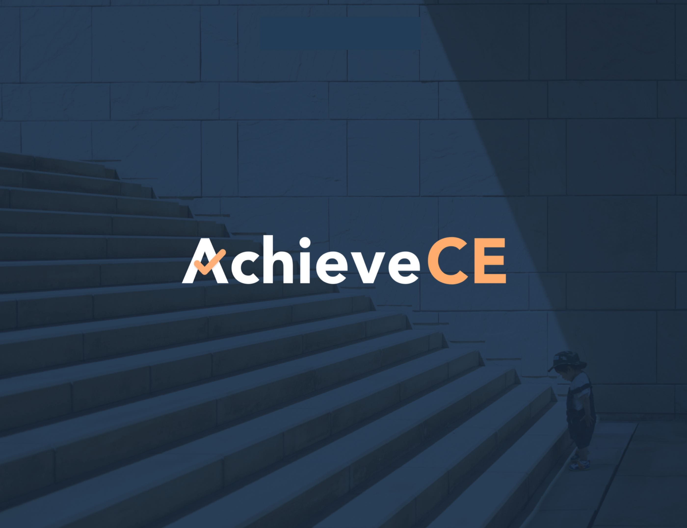
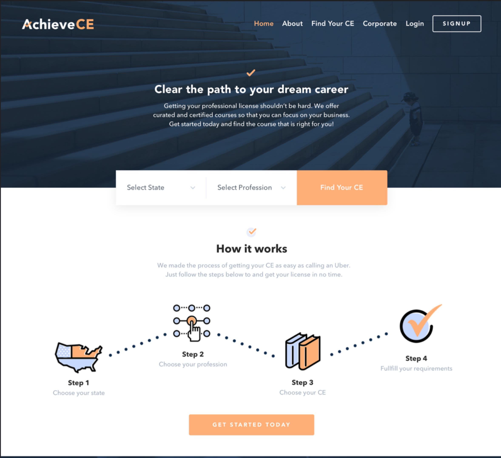

# AchieveCE

AchieveCE is the professional continued education marketplace of choice, by nurses and other medical professionals, in all 50 states. Currently AchieveCE has over 50,000 users.

## Roles served

Co-founder, Chief Executive Officer, Ideator, Designer, Developer, Project Director

## Requirements

Development, production

---
