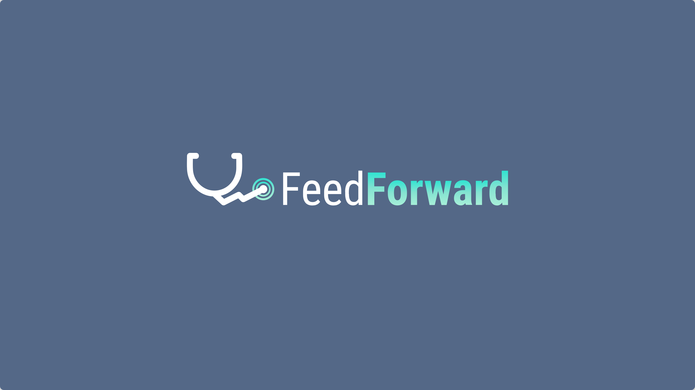

# FeedForward Health

FeedForward bridges the current gap that exists between how medical learners, faculty members, and organizations interact with regard to understanding how entrustable professional activities (EPA’s) are being performed.

## Roles served

Co-founder, Chief Technology Officer, Ideator, Designer, Developer, Project Director

## Requirements

Discovery, research, ideation, design, development, deployment

---

I joined FeedForward in 2018, and co-founded the company alongside two academic medical doctors located in Florida, to innovate and enhance the current processes that medical universities use today with respect towards medical curriculum.

## Value propositions

- Streamline the current processes of competency-based medical education by providing an easy-to-use application for medical residents and professionals to request and review evaluations.
- Provide invaluable metrics to medical organizations with regard to how programs, learners, and faculty members are performing with completing and evaluating EPA’s.
- Empower faculty members and administrators to take action with individual medical learners by enabling them to understand exactly how an individual is performing in various clinical rotations.
- Enable learners and faculty members to evaluate and receive more accurate and actionable insights on-demand.

Research points towards a shift in how medical programs worldwide are training the next generation of medical professionals. Competency-based medical learning (CBME) is being adopted wholeheartedly by organizations in an effort to further the quality of understanding by medical learners. Trends suggest that by 2026, there will be approximently 29,880 medical resident positions in the United States, which represents a nearly 3% annual increase year-over-year. As more and more programs adopt CBME methodologies, new mechanisms will be required to document how residents are trained to fill the increasing demand of medical physicians.

FeedForward bridges the current gap that exists between how medical learners, faculty members, and organizations interact with regard to understanding how entrustable professional activities (EPA’s) are being performed.

Currently, evaluations are often times being completed weeks or even months after a specific task has been performed, which leaves faculty members with a vague remembrance of how the learner performed, and in turn, provides the learner with a less impactful understanding of how they can improve.

By providing an easy-to-use application for medical learners and faculty, evaluations are requested on-the-spot, and evaluators are in a position to leave more thoughtful and accurate feedback. As a result, organizations are provided with meaningful metrics on how program members are performing.
