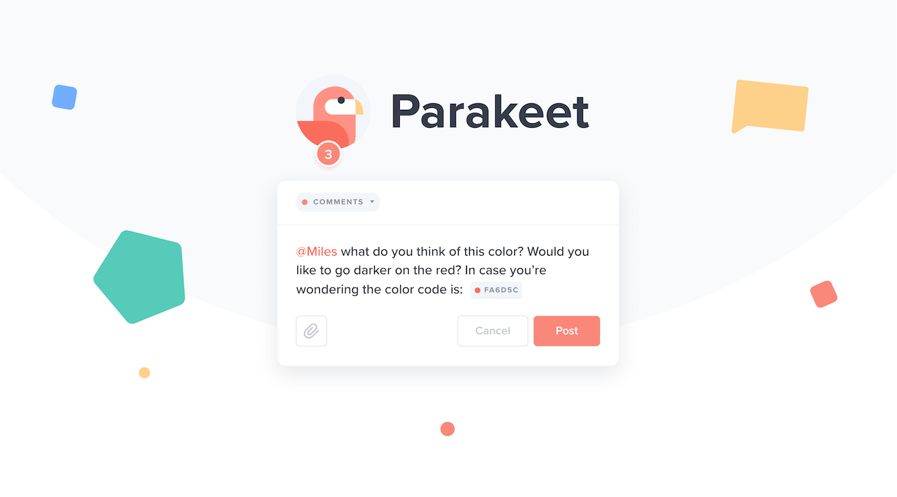

# Parakeet

Parakeet aims to bridge the gap and provide clear, concise, and actionable guidelines for leaving visual feedback, on digital products. Your very own project command room, a collaboration hub, Parakeet creates a dialogue and makes it easy for all project stakeholders to stay on the same page and adapt to changes.

Now more than ever, as teams shift to remote, and the rise of the freelance economy explodes, communication and collaboration are the single most important cultural-dynamic needed in order to reduce project failure rates and thrive as an organization.

## Roles served

Co-founder, Chief Executive Officer, Ideator, Developer, Project Director

## Requirements

Discovery, research, ideation, design, development, deployment

---

## Value Propositions

- Save time: 60% time savings by reducing the friction & misunderstanding of project requirements between clients & product teams.
- Increase project success: Ship better products by providing a framework for clients & product teams to solicit clear, concise, and actionable feedback in one platform.
- Reduce miscommunication: Provide the rosetta stone between non-technical and technical project stakeholders.

---

According to a Gallup study, it’s estimated that IT failure rates are between 5% and 15%, which represents a loss of $50 billion to $150 billion per year in the United States. Another study estimated that IT project failures cost the European Union €142 billion. Alarmingly, this could potentially represent a \$320B USD deficit annually.

With over 65% of top project leaders attributing client behaviors (revisions, insufficient time) as the #1 challenge that they face in their organization, it’s clear that communication becomes lost-in-translation and the understanding of requirements are blurry between project stakeholders.

---
