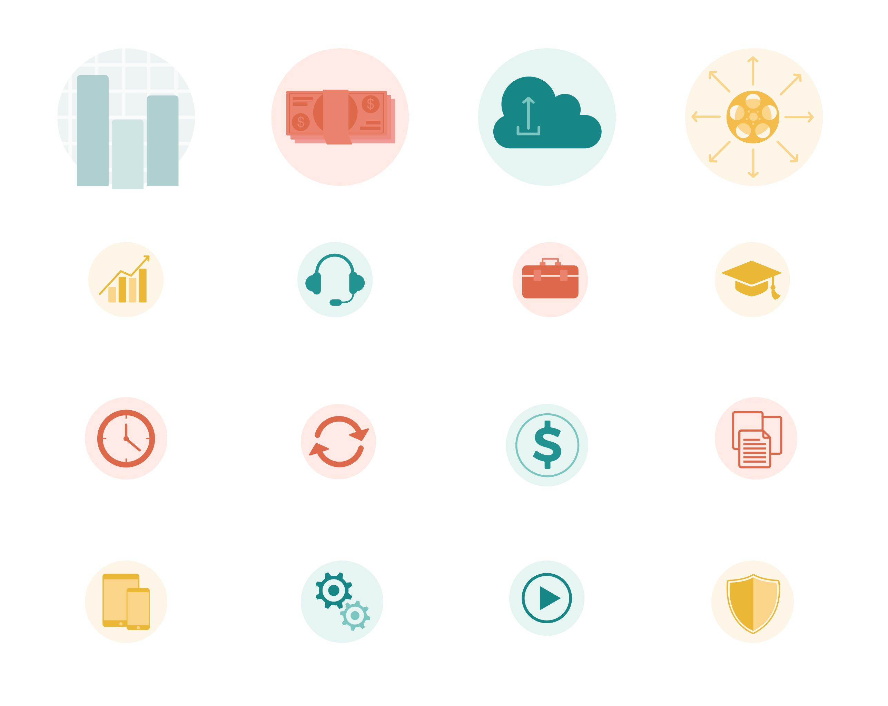

# Subchannel

Subchannel enables creators to distribute subscription-based content to any platform, while retaining control of what matters most to you. We developed a suite of tools in the latest web application frameworks to provide creators with everything they need to create their own "Netflix" experience.

## Roles served

Co-founder, Chief Executive Officer, Ideator, Designer, Developer, Project Director

## Requirements

Discovery, research, ideation, design, development, deployment

---

Subchannel’s target clients are educational organizations who are driven by innovation and are looking for new ways to distribute their original-produced content to their viewers. Our software and services provide greater control over how organizations monetize and enables them to build a scalable online presence. Subchannel provides the following:

- Web and mobile applications with your logo and branding
- A way to organize and store content on the cloud with our content management system (CMS)
- The ability to schedule your content for hourly, daily, and weekly distribution with our proprietary Timeline feature
- The ability to provide viewers with a library of on demand content for up to 7 days prior to your scheduled live feed
- A way to build your own advertising catalog and drag/drop them to your Timeline
- Generation of additional streams of revenue by creating a subscription-based model and charging viewers what you want

---
