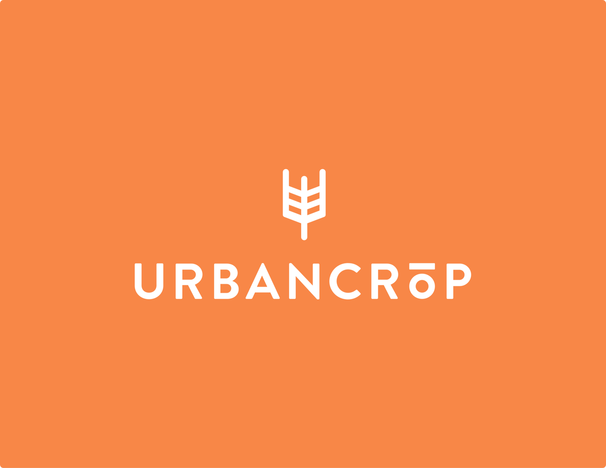
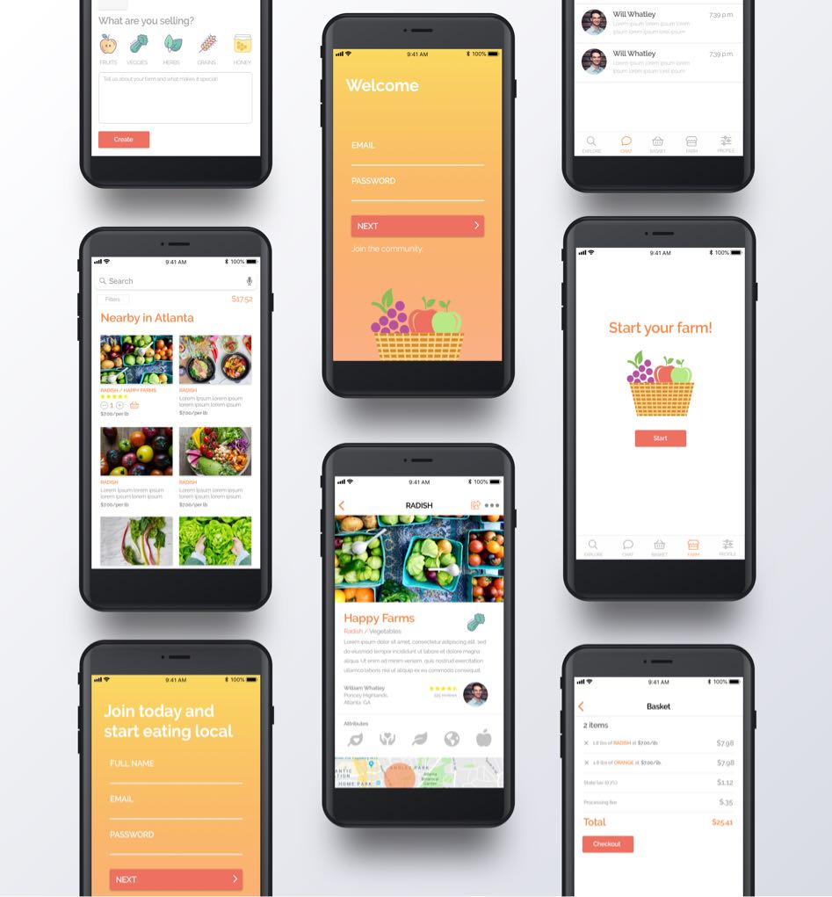

# UrbanCrop

UrbanCrop connects consumers to growers by enabling hobbyist and professional farmers alike to launch virtual farmers’ markets and advertise produce and other farm products to their local community. In turn, this creates a means for farmers to generate additional streams of revenue and have better insight into how much demand for product there is at any given time as opposed to estimating how much to bring to physical farmers markets. The consumer experience is easy-to-use, and gives residential and commercial buyers access to community-grown, fresh farm products.

## Roles served

Co-founder, Chief Executive Officer, Ideator, Designer, Developer, Project Director

## Requirements

Discovery, research, ideation, design, development, deployment

---

## Value Propositions

- Hyper-localize urban consumption by providing high-quality produce to communities.
- Allow farmers to generate new streams of revenue and gain insight into how much demand there is at any given time.
- Offer farmers’ markets on demand as opposed to having select times and locations.
- Enable hobbyists to launch their own agriculture business where they may have not had the means of distribution prior.
- Stabilize farmers by allowing them to receive investments on pre-harvested crop yields up-front, rather than waiting to sell and distribute.

---

Researchers have found that hyper-localization could generate as much as 15 billion kilowatt hours of annual energy savings worldwide, which is nearly half of the power generated by solar panels in the U.S. According to an article produced by citylab.com, “using Google’s Earth Engine software, as well as population, meteorological, and other datasets, researchers determined that, if fully implemented in cities around the world, urban agriculture could produce as much as 180 million metric tons of food a year—perhaps 10 percent of the global output of legumes, roots and tubers, and vegetable crops.” The additional added “ecosystem services” of realized hyper-localization represents a nearly \$160B annual industry.

---

## Significance

Research by the National Grocery Association in 2015 and others (Low, S. et al 2017) points towards a national phenomenon in how and what shoppers expect when purchasing groceries. This research states that, “The past two decades have witnessed a remarkable increase in the contribution of locally grown and raised foods to the U.S. food system. According to the U.S. Census of Agriculture statistics, direct sales of edible farm products for human consumption rose dramatically from $404 million annually in 1992 to roughly three times that amount ($1.2 billion) by 2007. By 2012, this sales value had topped \$1.3 billion per year, representing a 223 percent increase in growth over a 20‐year span and far outpacing the average rate of sales growth in the U.S. agricultural sector.”

Nevertheless, the sourcing of local foods is still inefficient for producers and inconvenient for consumers. Small farms continue to be challenged by the lack of distribution, processing, and marketing infrastructure that would give them wider market access to a larger volume of customers. Consumers are required to purchase products at the local farmers market, during at a specific time and location, or at the local grocery store at a premium of what it costs to produce the products. Furthermore, statistics show that small and mid-sized farms between 1992-2007, which have sales of more than $10,000 and less than $500,000 annually, declined by 21% (150,000).

What these statistics show is that the significant increase in locally produced foods, market growth of $5 billion to $12 billion between 2008 and 2014 in the U.S. alone, is concentrated in larger local producers as opposed to small and mid-sized farmers. UrbanCrop will provide small and mid-size producers with the ability to create virtual micro-hubs, which facilitates the advertising, management, transactions, and distribution of local food products to local communities. In turn, this will provide vendors with new ways to generate streams of revenue through innovative marketing mechanics and effective creation of hyper-localized supply chains in urban environments.

---
