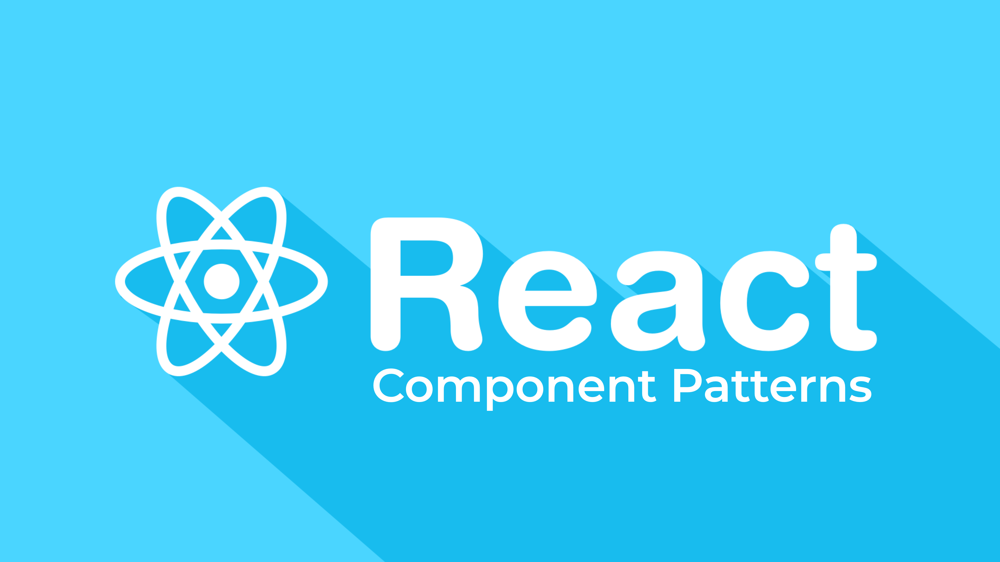
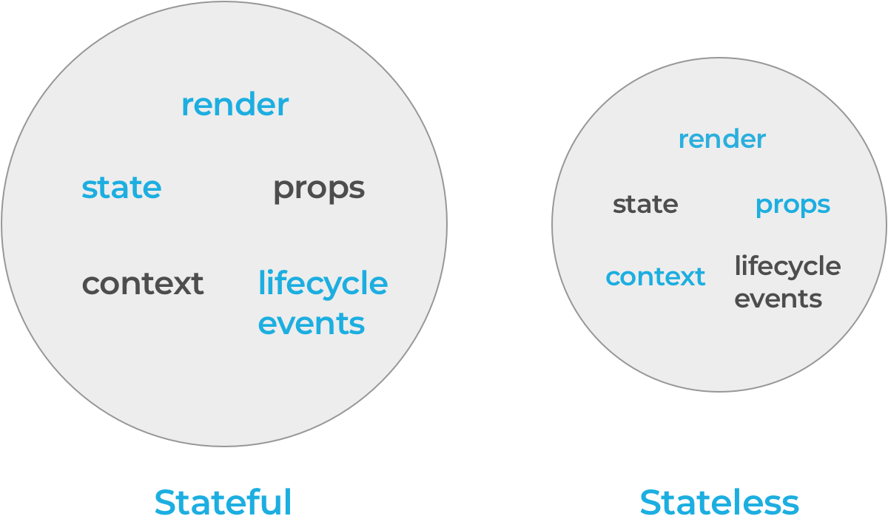

The diagrams provided are from an excellent talk that Michael Chan gave on React component patterns. I highly recommend watching the video.

## What is a component

According to reactjs.org, “Components let you split the UI into independent, reusable pieces, and think about each piece in isolation.”
The first time you npm install react you get one thing: a component and its API’s. Similar to JavaScript functions, a component accepts inputs called “props” and returns React elements, which describes (declares) what the user interface (UI) should look like. This is why React is referred to as a declarative API, because you tell it what you want the UI to look like and React takes care of the rest.
Think of declarative as you taking a taxi to a destination — you tell the driver where to go and he/she does the actual driving to get you there. Imperative would be the opposite — you’re driving yourself to get to your destination.

---

## Component API's

So what are these API’s you get when you install react? There are five and they are:

- render
- state
- props
- context
- lifecycle events

Although a component has full capability of utilizing all of the above API’s, you’ll find naturally that some components tend to use a few exclusively while other components use others exclusively. The dividing line between the two categorizes which are referred to as stateful and stateless components. Stateful components typically utilize stateful API’s: render, state, and lifecycle events, while stateless components use render, props, and context.

---

## Component Patterns

_Common component patterns are:_

- Container
- Presentational
- Higher order components (HOC’s)
- Render callback

---

## Container

_“A container does data fetching and then renders its corresponding sub-component. That’s it.” — Jason Bonta_

Containers are your data or logic layer and utilize stateful API’s. Using lifecycle events, you can connect to a state management store such as Redux or Flux, and pass down data and callbacks as props to children components. In the container’s render method is where you compose your UI consisting of presentational children components. In order to have access to all stateful API’s, a container must be a class component as opposed to a functional component.
In the example below, we have a class component called Greeting, which has state, a lifecycle event componentDidMount() and render.

At this point in time, this component is a stateful class component. In order to make Greeting a container component, we can split the UI into a presentational component, which I’ll illustrate below.

---

### Presentational

Presentational components utilize props, render, and context (stateless API’s) and can be the syntactically-pretty functional, stateless component.

Presentational components receive data and callbacks from props only, which can be provided by its container or parent component.

Together, containers and presentational components encapsulate logic and presentation to their prospective components:

As you can see, I’ve removed the presentational part from the Greeting class component into its own functional stateless component. Of course, this is meant to be a very easy example — with more complex apps, this is fundamental.

---

### Higher order components (HOC’s)

A higher order component is a function that takes a component as an argument and returns a new component.
This is a powerful pattern for providing fetching and data to any number of components and can be used for reusing component logic. Think react-router-v4 and Redux. With react-router-v4, you can use withRouter() to inherit methods passed as props to your component. And with Redux, you have access to actions passed as props when you connect({})() .

When exporting my component, I’m wrapping it with react-router-v4’s withRouter() . Up above in App’s lifecycle event componentDidMount() , I’m updating state with the value provided by this.props.location.pathname . By wrapping my component with withRouter() , my class component now has access to react-router-v4’s methods via props, hence this.props.location.pathname . This is just one example of many.

---

### Render callbacks

Similar to higher order components, render callbacks or render props are used to share or reuse component logic. While many developers tend to lean more towards HOC’s for reusable logic, there are some very good reasons and advantages to use render callbacks — this is best explained in Michael Jackson’s “Never write another HOC.” Just to touch base on some of the talk’s key points, render callbacks provide the luxury of reducing namespace collision and better illustrate where exactly the logic is coming from.

Above in the Counter class, I’m nesting this.props.children in the render method and taking this.state as an argument. Below in the App class, I’m able to wrap my component in the Counter component, hence having access to Counter’s logic. The render callback part is line 28, where I have {state => ()} — bam! I automagically have access to Counter’s state above.

---

## Thank you for reading!

I’m always open to any suggestions to make explanations better — I learn by writing so this is far from perfect and is just my take on the subject of React component patterns.

---

### Resources:

- Michael Chan’s talk on React Patterns
- Michael Jackson’s talk on Never Use HOC’s
- reactjs.org
