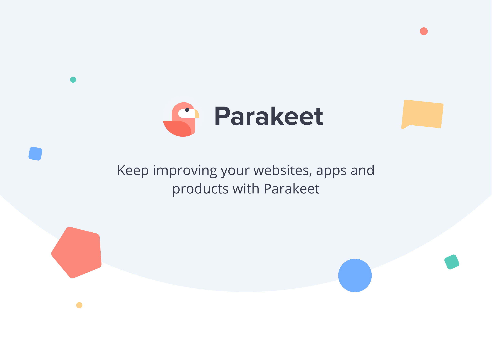

# Welcome to Parakeet

_A collaboration-hub that enables remote project teams to save time and thrive._

Hello everyone! I’m extremely excited to unveil what my co-founder, Alex Duffner, and I have been working on the past 6 months. Together, we built Parakeet: a platform focused on solving the increasingly difficult challenge of soliciting, collecting, and acting on meaningful feedback within remote product teams.

We’ve all been there — the client wants this, the developer understands that, the designer creates something, and the project manager interprets differently. Understanding client and product owner requirements is difficult and not only is it difficult, it’s extremely expensive and time-consuming.

We believe continuous improvement and documenting product iterations is important to achieve project success, which is why we created Parakeet, a visual approach to keep everyone on the same page.

## The Product

Our MVP iteration, while simple, has already proved to provide tremendous value with our 1st adopters. We enable teams to create projects, upload images or add a website URL, invite project stakeholders, and collaborate by leaving a digital sticky-note right on top of live websites and applications.

By using Parakeet, product teams have already shown to save time, increase project success, and improve communication and collaboration. We’ve also learned what our users don’t like and how we can improve certain user experiences and flows.

We’ve got some exciting features coming soon, including an enhanced commenting experience, project management integrations, and other innovations, which we’ll continue to update our platform and users with.

At Parakeet, we’re using technologies such as React.JS, Node.JS, MongoDB, and AWS.

## The Team

Remote-first, built by remote workers for remote workers. Alex and I have over 12 years combined product leadership experience. We bring a unique perspective from our very own challenges and we built a platform that solves those frustrations. Poor communication, collaboration, alignment, adaptation and leanness plague the very industry that we know and love. We set forth to define a new remote workplace, one in which projects and communications are unified, clear, and concise.

Since February, we’ve completed our MVP iteration and secured an interview with Y-Combinator for the upcoming 2020 Winter Batch. We’ve built a small beta testers community and we’re looking to launch November 14th.

We’d love your feedback and help in improving our product, so if you’re a developer, designer, project manager, or product owner who sees value in streamlining project communication,we’re extending our beta testing phase to you, and you can sign up  
<a target="_blank" style="text-decoration: underline;" href="https://app.flyparakeet.com/signup">here.</a>
